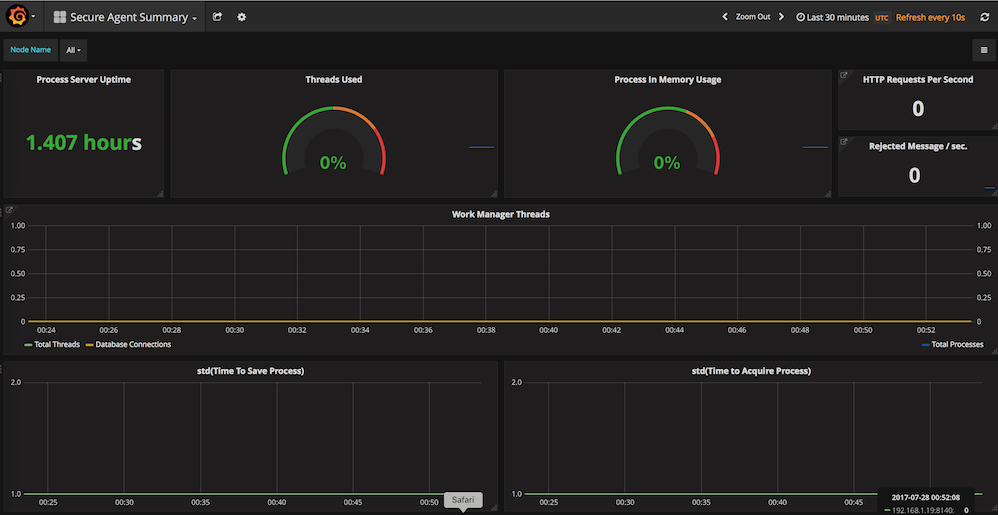

# Summary

The goal is to provide real time monitoring of a Informatica® Secure Agent running the a licensed Process Engine package.



# Setup Instructions

These are written for installing with [Docker](https://www.docker.com/), [Docker for Mac](https://www.docker.com/docker-mac) or [Docker for Windows 10](https://www.docker.com/docker-windows) version 17.06 or higher. The docker-compose file is written using version 2 so should be compatible with Docker version 1.10.0+, but certain commands in these instructions like 'docker volume' require a newer version of Docker.

Check your docker version to verify your version:
```
>$ docker version
Client:
 Version:      17.06.0-ce
 API version:  1.30
 Go version:   go1.8.3
 Git commit:   02c1d87
 Built:        Fri Jun 23 21:31:53 2017
 OS/Arch:      darwin/amd64

Server:
 Version:      17.06.0-ce
 API version:  1.30 (minimum version 1.12)
 Go version:   go1.8.3
 Git commit:   02c1d87
 Built:        Fri Jun 23 21:51:55 2017
 OS/Arch:      linux/amd64
 Experimental: true
```

See Docker documention for insallation instructions. Also, if you're using Docker with Virtual Box then there may be additional steps required, but I haven't tested with Virtual Box.

## Step 1 - Configure Exporter on Secure Agent

Download [jxm_exporter](https://github.com/prometheus/jmx_exporter) from Github.  Direct link to the [Prometheus Agent](https://repo1.maven.org/maven2/io/prometheus/jmx/jmx_prometheus_javaagent/0.12.0/jmx_prometheus_javaagent-0.12.0.jar).

* Copy the JAR to the server running the Informatica Secure Agent. I suggest using a directory that won't be overwritten during agent upgrades, for example:
```
 C:\Program Files\Informatica Cloud Secure Agent\apps\process-engine\ext
 ```
* Copy the Prometheus Agent configuration file from `config/agent/sa-config.yml` to the same directory as the JAR above.

   > This sa-config.yml is a template of some common metrics available from the process-server via JMX. Refer to the Prometheus documentations to add additional metrics. You can find additional metrics by connecting a tool like JMC or VisualVM to the secure-agent JVM.

* On Informatica Cloud®, add `-javaagent:../ext/jmx_prometheus_javaagent-0.12.0.jar=8140:../ext/sa-config.yml` to the secure agent Process Server 'jvm' configuration property named 'additional-properties' as shown below.


  > **Note:** The above configuration references a jmx_prometheus_javaagent jar with version 0.12.0, which may need to change to match the jar you copied to the 'ext' folder.  Additionally, the metrics are configured to be exposed on port 8140, if you need to expose the metrics on a different port you'll need to alter the port number in this configuration string above.

* Restart the Informatica Secure Agent.

## Step 2 - Creating a Data Volume
Define the volume to store the metrics data collected by [Prometheus](https://prometheus.io). This will allow for future upgrades of the docker containers without losing any historical data.
```docker
docker volume create --name metrics_data
```

If you ever need to see the contents of the metrics_data volume you can use the following command:
```docker
docker run --rm -i -v=metrics_data:/prometheus busybox find /prometheus
```

## Step 3 - Configure Prometheus

Edit the file located at `config/prometheus/prometheus.yml` to add the IP address or DNS name to your secure agent.

Find the static_configs section of the YAML file and change the targets array to include the 1 or more agents to your secure agents.

```yaml
static_configs:
      - targets: ['127.0.0.1:8140']
        labels:
          group: 'secure-agent'
          env: 'production'
```

For example, the above might become:
```yaml
static_configs:
      - targets: ['agent1.mycompany.com:8140','agent2.mycompany.com:8140']
        labels:
          group: 'finance-agent-group'
          region: 'north-america'
          env: 'production'
```
See Prometheus documentation regarding [configuration](https://prometheus.io/docs/operating/configuration/#<static_config>) and [labels](https://prometheus.io/docs/concepts/data_model/#metric-names-and-labels).

## Step 4 - Start Services

From the root directory of this Github project run the following:

```docker
docker-compose up -d --build
```
This will build the grafana image with and will include the pre-defined dashboards found in the `images/grafana/dashboards` directory.  It will also start Prometheus and Grafana and will install the Prometheus datasource when the container is started.

## Step 5 - Dispatch Service Configuration (Optional)

The 'SA Summary' dashboard expects a couple of Dispatch Services configured to render a couple of the single-stat panels.

  > In newer versions of the process-server application deployed to your secure agent, Informatica has already defined a handful of default Dispatch Services. If your agent already has some defined, skip this step.


The two dispatch services that can optionally be added are `avBusinessConnectionRESTService` and `avHostEnvironmentRuntimeAccess`.  If you are not sure what values to enter for 'Max Concurrent', 'Max In-Memory', 'Max Queued', and 'Timeout' then use the same values that are currently configured for the 'SystemDefault' dispatch service.

### Example Configuration


## Step 6 - Login

Visit http://localhost:3000 to get to Grafana to view the dashboards.  The default username and password is admin/admin.

You can view all the metrics being collected in the Prometheus application at http://localhost:9090.

## Step 7 - Dashboards

Dashboards are written with queries that assume the metrics are collected from a target using port 8140. If you changed the port in Step #1, then you'll need to update the queries used in each dashboard panel.

For example, on the Dispatch Summary Dashboard there is a panel named 'Completed Rate' with the following query:

`sum(irate(sa_dispatchstatistics_dispatchstatistics_completedrequestcount{instance=~"$host:8140"}[1m]))`

but if you started the metrics collection port on port 9555 then you'd update the above query to:

`sum(irate(sa_dispatchstatistics_dispatchstatistics_completedrequestcount{instance=~"$host:9555"}[1m]))`

## Step 8 - PostGreSQL Monitoring (Optional)

Not yet implemented.

Options include using one of the dashboards found at:

* https://grafana.com/dashboards/455
* https://grafana.com/dashboards/355

Any contributions to add PostGreSQL monitoring are appreciated.

# Alerting

Not yet implemented.

But can easily be extended by adding the [Prometheus AlertManager](https://github.com/prometheus/alertmanager) into this configuration.  See AlertManager documentation for configuring routing rules for alerts received by Prometheus.

By default this project has configured some rules as examples of the types of alerts you might be interested in. As you add additional metrics into sa-config.yml you'll likely want to add additional rules.

Any contributions to add alerting will be appreciated.

# Troubleshooting

## Windows Users

* If you encounter the following error, you'll need to convert line endings in the file located at *images/grafana/config-n-run.sh* from CRLF to LF.  

  `standard_init_linux.go:190: exec user process caused "no such file or directory"`

  You can use a tool like *dos2unix* or your favorite editor if it supports it.

* If the prometheus and/or the grafana container crashes shortly after starting you may need to convert the relative paths, located in file *docker-compose.yml*, to absolute paths. For example,

  'build: ./images/grafana'

  would become

  'build: C:\git\secure-agent-monitor\images\grafana'

  There are multiple locations that will need to be converted and the path will vary depending on where you cloned this repo.


# Disclaimer
This project is not affiliated with Informatica, LLC. All Informatica product names are trademarks or registered trademarks of Informatica, LLC. All other company and product names are trademarks or registered trademarks of their respective companies.
