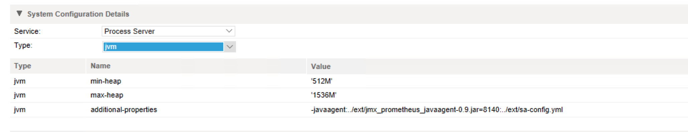

# Setup Instructions

These are written for installing with [Docker](https://www.docker.com/), [Docker for Mac](https://www.docker.com/docker-mac) or [Docker for Windows 10](https://www.docker.com/docker-windows). See Docker documention for insallation instructions.

If you're using Docker with Virtual Box then there may be additional steps required, but I haven't tested with Virtual Box.

## Step 1 - Creating a Data Volume
Define the volume to store the metrics data collected by [Prometheus](https://prometheus.io). This will allow for future upgrades of the docker containers without losing any historical data.
```docker
docker volume create --name metrics_data
```

If you ever need to see the contents of the metrics_data volume you can use the following command:
```docker
docker run --rm -i -v=metrics_data:/prometheus busybox find /prometheus
```

## Step 2 - Configure Prometheus

Edit the file located at `config/prometheus/prometheus.yml` to add the IP address or DNS name to your secure agent.

Find the static_configs section of the YAML file and change the targets array to include the 1 or more agents to your secure agents.

```yaml
static_configs:
      - targets: ['127.0.0.1:8140']
        labels:
          group: 'secure-agent'
          env: 'production'
```

For example, the above might become:
```yaml
static_configs:
      - targets: ['agent1.mycompany.com:8140','agent2.mycompany.com:8140']
        labels:
          group: 'finance-agent-group'
          region: 'north-america'
          env: 'production'
```
See Prometheus documentation regarding configuration and labels.

## Step 3 - Start Services

From the root directory of this Github project run the following:

```docker
docker-compose up --build
```
This will build the grafana image with and will include the pre-defined dashboards found in the `images/grafana/dashboards` directory.  It will also start Prometheus and Grafana and will install the Prometheus datasource when the container is started.

## Step 4 - Configure Exporter on Secure Agent

Download [jxm_exporter](https://github.com/prometheus/jmx_exporter) from Github.  Direct link to the [Prometheus Agent](https://repo1.maven.org/maven2/io/prometheus/jmx/jmx_prometheus_javaagent/0.9/jmx_prometheus_javaagent-0.9.jar).

* Copy the JAR to the server running the Informatica Secure Agent. I suggest using a directory that won't be overwritten during agent upgrades, for example:
```
 C:\Program Files\Informatica Cloud Secure Agent\apps\process-engine\ext
 ```
* Copy the Prometheus Agent configuration file from `config/agent/sa-config.yml` to the same directory as the JAR above.
* Add `-javaagent:./ext/jmx_prometheus_javaagent-0.9.jar=8140:../ext/sa-config.yml` to the secure agent Process Server config on Informatica Cloud.

* Restart the Informatica Secure Agent.

## Step 5 - Dispatch Service Configuration (Optional)

The 'SA Summary' dashboard expects a couple of Dispatch Services configured to render a couple of the single-stat panels.


The two dispatch services that can optionally be added are `avBusinessConnectionRESTService` and `avHostEnvironmentRuntimeAccess`.  If you are not sure what values to enter for 'Max Concurrent', 'Max In-Memory', 'Max Queued', and 'Timeout' then use the same values that are currently configured for the 'SystemDefault' dispatch service.

### Example Configuration


## Step 6 - PostGreSQL Monitoring (Optional)

Not yet implemented.

Options include using one of the dashboards found at:

* https://grafana.com/dashboards/455
* https://grafana.com/dashboards/355

Any contributions to add PostGreSQL monitoring are appreciated.

# Alerting

Not yet implemented.

But can easily be extended by adding the [Prometheus AlertManager](https://github.com/prometheus/alertmanager) into this configuration.  See AlertManager documentation for configuring routing rules for alerts received by Prometheus.

Any contributions to add alerting will be appreciated.